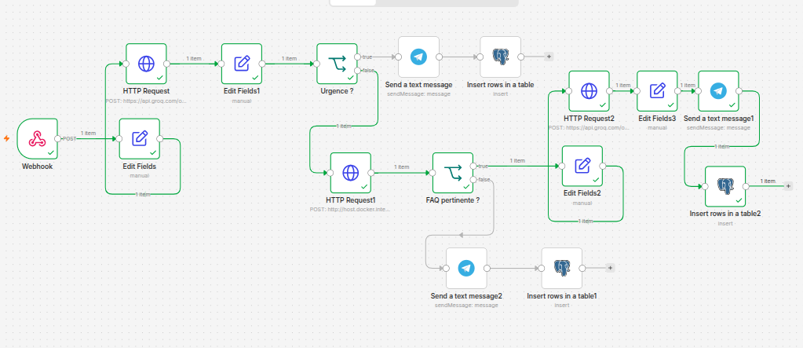
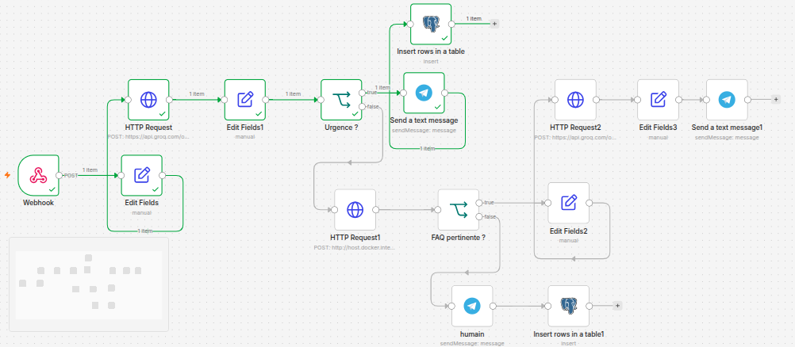
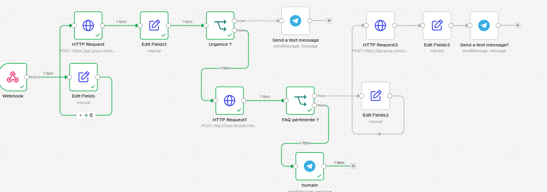

# Agent de triage support client avec RAG

Agent IA qui classe les messages clients, cherche une réponse dans une base
de connaissances (RAG), décide de répondre automatiquement ou d'escalader
vers un humain — avec validation et alertes en temps réel.

## Architecture

## Stack
- n8n (orchestration)
- FastAPI + sentence-transformers (micro-service RAG)
- PostgreSQL + pgvector, hébergé sur Supabase (base vectorielle + logs)
- Groq (Llama 3.3) — classification et génération
- Telegram Bot API (escalade et validation humaine)

## Résultats
| action            | count |
| ----------------- | ----- |
| escalade_urgence  | 1     |
| escalade_hors_faq | 2     |
| reponse_directe   | 3     |

## Installation
1. `cd python && pip install -r requirements.txt`
2. Copier `.env.example` en `.env`, remplir les vraies valeurs
3. `python3 ingest.py`
4. `python3 -m uvicorn main:app --port 8000`
5. `cd n8n && docker compose up -d`
6. Importer `n8n/workflow.json` dans n8n, reconnecter les credentials

## Limites connues
- FAQ volontairement réduite (~20 entrées) pour rester démonstratif
- Pas d'authentification utilisateur (usage interne)
